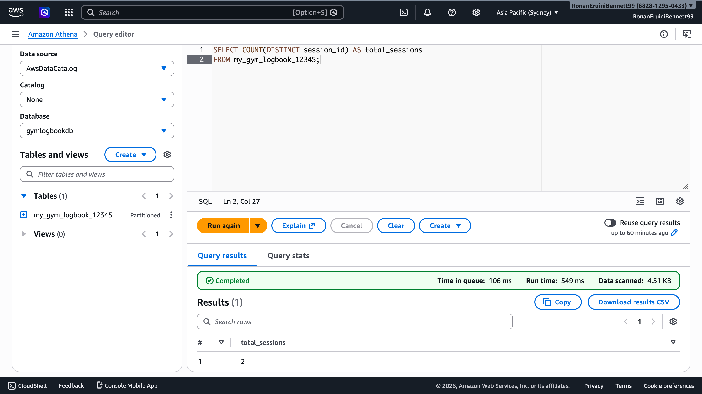
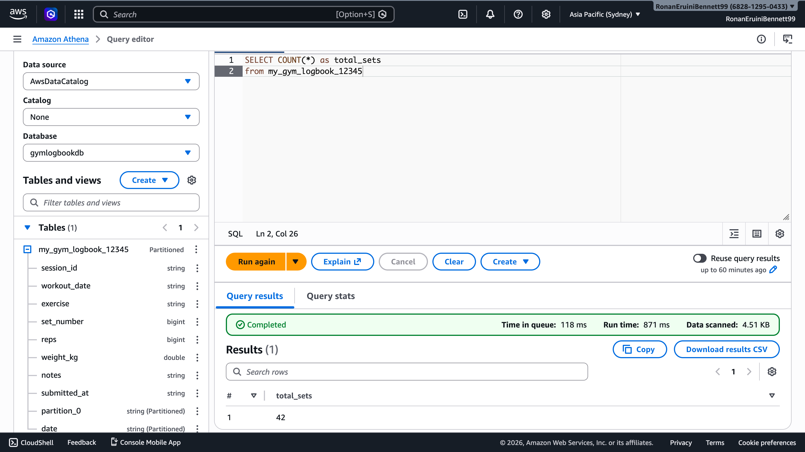
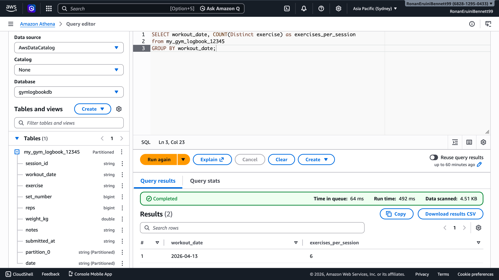
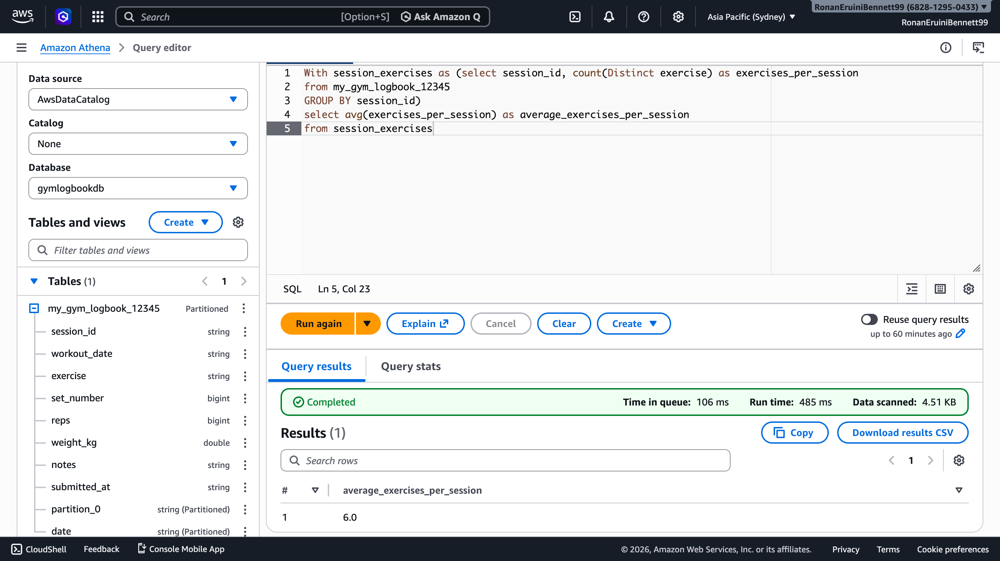
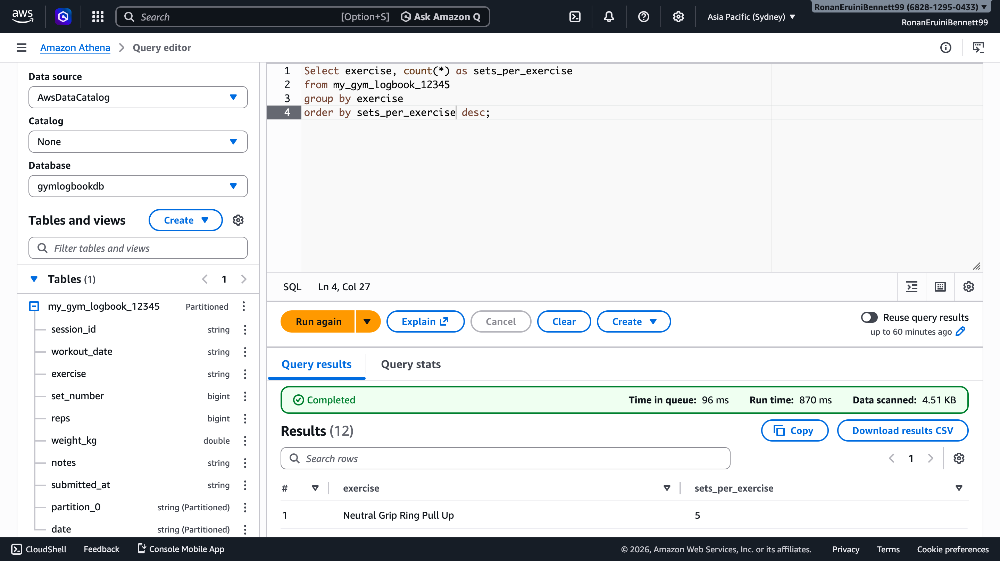
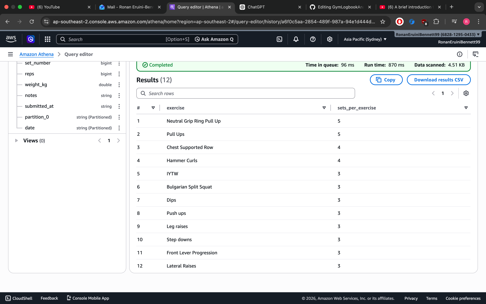
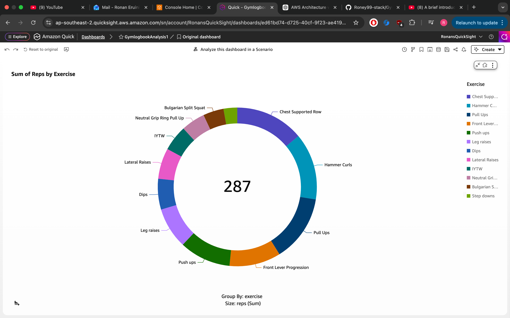
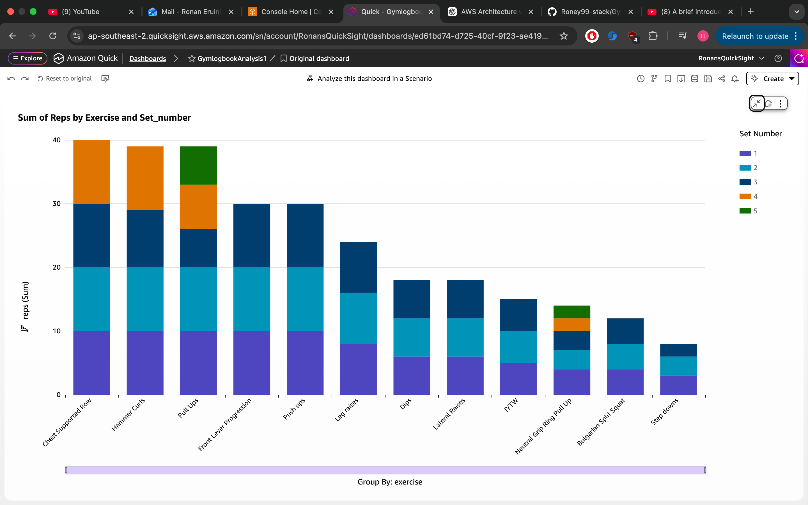
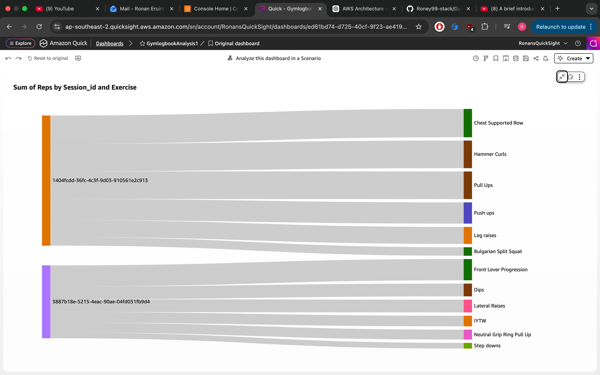

# GymLogbookAnalytics

## Overview

This project is a serverless data pipeline built on AWS to collect, validate, transform, and analyse gym workout data in near real time.

The system ingests structured workout data from a web application, processes it using AWS Lambda, stores it in S3, and enables analytical querying through Athena and visualisation in QuickSight.

The project focuses on:

* building a complete frontend-to-analytics pipeline
* handling real-world data validation and transformation challenges
* understanding how data format decisions impact downstream analytics

## Trade-offs & Limitations

- **Serverless backend (Lambda, API Gateway)**  
  Chosen to eliminate infrastructure management and optimise cost for low-volume, event-driven workloads.  
  Trade-off is reduced control over the execution environment, potential cold starts, and limited ability to fine-tune performance.

- **Athena + QuickSight for analytics (schema-on-read)**  
  Enables querying data directly from S3 without maintaining a data warehouse, making it well-suited for ad hoc and infrequent queries.  
  Trade-off is slower query performance and reliance on consistent data formatting compared to pre-processed or indexed systems.

- **Static frontend (S3 + CloudFront)**  
  Provides a low-cost, globally distributed method for serving the application with high availability.  
  Trade-off is limited support for dynamic server-side rendering and reduced flexibility compared to a fully managed backend framework.

- **Cognito over custom authentication (managed identity service)**  
  Selected to handle authentication, authorisation, and token management without building a custom auth system.  
  Trade-off is reduced flexibility in user flows and less control over authentication logic compared to a custom-built solution.

- **CSV over Parquet or JSON (data format choice)**  
  Chosen for simplicity of transformation and compatibility with Athena’s schema-on-read querying.  
  Trade-off is lack of schema enforcement and lower query efficiency compared to columnar formats like Parquet at scale.

## Project Structure
```
.
├── Athena_Queries/        # Screenshots of Athena queries and results
├── README.md              # Project documentation
├── architecture.png       # Cloud architecture diagram
├── lambda                 # Lambda function code for transformation and validation
├── sample-data            # example lambda event and output csv
├── Quicksight             # Dashboard Screenshots and results
```
## Architecture


## Key Design Decisions

* **CSV over JSON for storage**
  Data is transformed into CSV to enable efficient querying with Athena using a schema-on-read approach.

* **Serverless architecture**
  Lambda, API Gateway, and S3 were used to eliminate server management and allow the system to scale automatically.

* **Frontend + backend validation layers**
  Input validation is performed both in the browser (UX) and in Lambda (data integrity and security).

* **Partition-style S3 key structure**
  Files are stored using a date-based prefix to improve query performance and organisation.

* **Decoupled ingestion and analytics**
  Data ingestion is separated from querying (Athena/QuickSight), allowing independent scaling and iteration.

## Tech Stack

**Frontend**

* HTML, JavaScript

**Cloud & Infrastructure**

* S3, CloudFront, Route 53, API Gateway, Lambda, Cognito, ACM

**Data & Analytics**

* AWS Glue, Athena

**Visualisation**

* QuickSight

## Data Pipeline

### 1. Frontend & Delivery

* User accesses the application via a custom domain
* DNS is resolved using Route 53
* Static frontend is served through CloudFront from an S3 bucket (OAC enabled)

### 2. Authentication

* User clicks "Login" and is redirected to Amazon Cognito
* After successful authentication, Cognito redirects back with a JWT token

### 3. Data Ingestion

* User submits workout data via the web form
* API Gateway validates the request using Cognito User Pool authorisation
* Data is posted to an AWS Lambda function
* Backend validation ensures required fields such as `reps` and `weight_kg` are not empty or null
* Invalid inputs raise structured errors in Lambda using Python exceptions
* Responses follow a consistent JSON format with status codes:

  * `200` for success
  * `400` for invalid user input
  * `500` for unexpected system errors
* Frontend validation (HTML required fields) provides immediate feedback before submission

### 4. Data Processing & Storage

* Lambda parses incoming JSON event data from API Gateway
* Nested workout data (exercises and sets) is validated for completeness and structure
* Data is flattened into row-based format suitable for tabular analysis
* Rows are written into an in-memory CSV using Python (`io.StringIO`, `csv.writer`)
* A unique S3 object key is generated per workout session
* The CSV file is uploaded to S3 for downstream analytics

### 5. Data Analytics

* AWS Glue crawlers catalog the data
* Amazon Athena queries the dataset
* Amazon QuickSight visualises trends and performance insights

## Live Demo
- Web App: https://rebgymlog.info

## Athena Queries Examples
- These queries were used to analyse workout patterns and extract insights from the dataset.

### Total Workout Sessions


### Total Sets


### Exercises per date


### Average Exercises per session


### Total sets per Exercise



## Quicksight Visualisation Examples
Interactive QuickSight visualisations exploring gym performance metrics and training patterns.

### Donut Chart Sum of Reps per Exercise


### Stacked Bar chart Sum of Reps by Exercise and Set Number


### Sankey Diagram Sum of Reps by Session and Exercise


## Future Improvements

### Application Features
- Prefill or duplicate values from the previous set
- Display last week’s weights alongside each exercise
- Save and suggest exercises from previous sessions
- Allow users to select and reuse saved workouts
- Add support for assisted bodyweight exercises, including band-assisted options
- Add body weight metric

### Data Quality & Processing
- Sanitize multiline notes before writing to CSV
- Improve input validation to reduce malformed or incomplete records
- Extend the schema to capture heart rate or RPE data per set
- Expand dataset size for more meaningful analysis

### Analytics & Platform
- Add richer QuickSight dashboards for progress tracking and exercise trends
- Convert processed CSV data into Parquet for more efficient querying
- Automate deployment and updates with CI/CD using GitHub actions

## Challenges and Learnings

- Debugged ingestion issues caused by multiline CSV fields breaking schema-on-read parsing in Athena  
- Identified problems caused by incorrect file formats (.numbers vs CSV) in S3  
- Integrated Cognito authentication with API Gateway and frontend JavaScript  
- Designed and implemented an end-to-end serverless data pipeline  
- Structured SQL queries to extract meaningful insights from workout data  
- Developed an understanding of how data formatting impacts downstream analytics systems
- Understood how AWS credential resolution works locally vs in Lambda (environment variables, profiles, and IAM roles)
- Leveraged AI-assisted development tools to generate, debug, and refine Lambda functions, infrastructure configuration, and frontend logic, accelerating prototyping while validating system behaviour  
